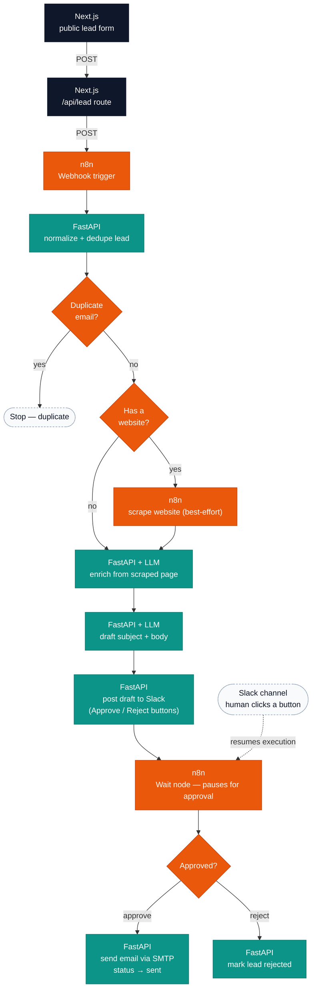

# AI Lead Automation

An open-source, self-hosted lead pipeline. Run it on your own server: it
captures leads from a web form, enriches them by scraping the lead's
company website, drafts a personalized outreach email with an LLM, sends
the draft to Slack for human approval, and sends the email once approved.

Single-tenant, no dashboard, no accounts beyond a shared secret that
protects the setup wizard. **n8n orchestrates, FastAPI thinks, Next.js is
the human surface.**

## Quickstart

```bash
git clone https://github.com/ChristianMendozaa/ai-lead-automation.git
cd ai-lead-automation
cp .env.example .env
./scripts/gen-secrets.sh >> .env    # fills in the three secret keys
docker compose up -d
```

Then open **http://localhost:3000/setup** and enter the `SETUP_TOKEN`
value from your `.env`. Complete the four required steps (Business → OpenAI →
SMTP → Slack) — each step that calls a real service makes a live test
call and won't let you continue until it passes. Once done, `/` serves
the public lead form.

A fifth **Branding** step is optional and can be skipped: colors, logo,
font, brand voice, a call-to-action button, and a footer/signature. Fill
it in (with a live preview) to have outreach emails render as a styled
HTML email matching your business instead of a plain-text template —
leave it blank and emails still send fine with a neutral style.

## How it works



<sub>🔵 Next.js &nbsp; 🟠 n8n (orchestration) &nbsp; 🟢 FastAPI (business logic) &nbsp; ⚪ human step</sub>

- **Next.js** — the public lead form and the `/setup` wizard. No dashboard;
  Slack is the only review surface.
- **n8n** — orchestrates the pipeline (webhook, scrape, retries/pausing).
  The bundled workflow (`n8n/workflows/lead-pipeline.json`) is
  auto-imported and published on first boot — you never build it by hand.
- **FastAPI** — all business logic: validation, enrichment, drafting,
  sending, and encrypted credential storage.
- **Postgres** — one database for lead state (`leads` table) and encrypted
  credentials (`app_config`), plus n8n's own separate database in the same
  instance.

## Configuration reference

Secrets (`APP_ENCRYPTION_KEY`, `N8N_ENCRYPTION_KEY`, `SETUP_TOKEN`) are
generated by `scripts/gen-secrets.sh` — don't hand-edit them into
`.env.example`. Everything else:

| Variable | Purpose |
|---|---|
| `POSTGRES_USER` / `POSTGRES_PASSWORD` / `POSTGRES_DB` | Shared Postgres credentials (backend's `leads` DB; n8n gets its own `n8n` DB in the same instance, created automatically on first boot). |
| `N8N_OWNER_EMAIL` / `N8N_OWNER_PASSWORD` | Pre-provisions n8n's owner account so no one has to click through n8n's signup screen. |
| `PUBLIC_APP_URL` | Public URL the frontend is reachable at. **Approval links in Slack point here** (`{PUBLIC_APP_URL}/approval`) — if the people approving drafts aren't on the host machine, this must be a real, reachable URL (put the frontend, port 3000, behind a reverse proxy/tunnel). Defaults to `http://localhost:3000`, which only works if you're approving from the same machine. n8n itself no longer needs to be publicly reachable — `/approval` resumes its wait webhook server-side. |
| `N8N_FORCE_REIMPORT` | Set to `true` to discard any edits made in the n8n UI and re-import `lead-pipeline.json` on next boot. |
| `OPENAI_MODEL` | Model used for enrichment and drafting. The API key itself is entered via `/setup`, not here. |
| `DUPLICATE_WINDOW_DAYS` | How many days to look back when deduping incoming leads by email. |

## Setting up Slack

1. Create an app at [api.slack.com/apps](https://api.slack.com/apps).
2. Under **OAuth & Permissions**, add the `chat:write` bot scope.
3. Install the app to your workspace.
4. Copy the **Bot User OAuth Token** (starts with `xoxb-`).
5. Invite the bot to your target channel: `/invite @your-app-name`.

Paste the token and channel into the Slack step of `/setup`.

## Setting up SMTP

Any SMTP account works. For Gmail, use an
[app password](https://myaccount.google.com/apppasswords) rather than your
regular account password — Google blocks plain-password SMTP login for
third-party apps.

## Business info and the lead form's website field

The **Business** step in `/setup` (company name, optional sender name,
fallback language) isn't tested against any external service — it's just
used so drafted emails sign off as "Best, the Acme Corp team" instead of a
placeholder.

Company-website enrichment is normally derived from the lead's email
domain (`jane@acmecorp.io` → `acmecorp.io`), which only works for
business email addresses — it's skipped for personal domains (Gmail,
Yahoo, Outlook, etc.). The lead form has an optional **Company website**
field for exactly that case: if the lead fills it in, it's used directly
instead of guessing from their email.

## Emails are written in the lead's language automatically

The lead form has no language picker — instead, the drafted email is
auto-translated. The LLM infers the language from the lead's free-text
message (falling back to the language of their company website, then to
the fallback language set in the Business step) and writes the entire
email — subject, greeting, body, call-to-action, sign-off — in it. A lead
who writes in Spanish gets a Spanish reply with no configuration needed.

## Development

```bash
# Backend tests (no live services needed)
docker compose build backend
docker run --rm --entrypoint pytest ai-lead-automation-backend

# Full stack
docker compose up -d
docker compose logs -f
```

## License

MIT — see [LICENSE](LICENSE).
